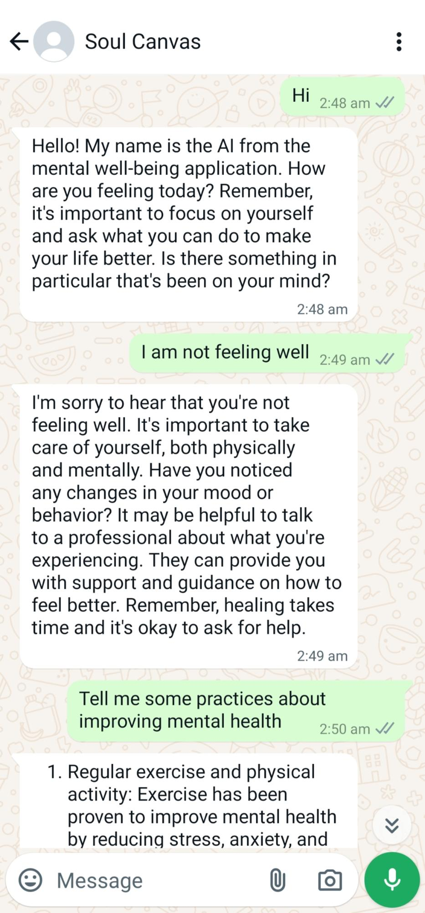
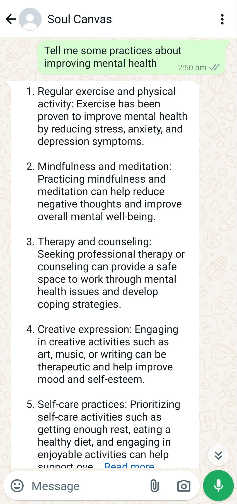

# **Mental Health Assistant**

This solution leverages Large Language Models (LLMs) to provide supplementary support for mental well-being, integrated with WhatsApp for enhanced accessibility.

### **Mental Health:**

* Mental health encompasses our emotional, psychological, and social well-being.  
* It affects how we think, feel, and act.  
* It also determines how we handle stress, relate to others, and make healthy choices.  
* Mental health is crucial at every stage of life, from childhood and adolescence through adulthood.

### **Introducing our solution:**

Our solution enables users to converse with our mental health assistant directly through WhatsApp. It provides creative expression tools for emotional release and self-exploration, facilitating a holistic approach to mental health support.

**Key features include:**

* Engaging users in meaningful conversations about their mental health.  
* Asking further clarifying questions if any areas of concern are detected, to better understand the user's emotional state and provide personalized support.  
* Recommending seeking professional help or therapy if the mental health situation is critical or serious.

In the example below, a user interacts with the mental health assistant via WhatsApp, discussing their feelings and receiving tailored support.

### Flow Diagram : 

